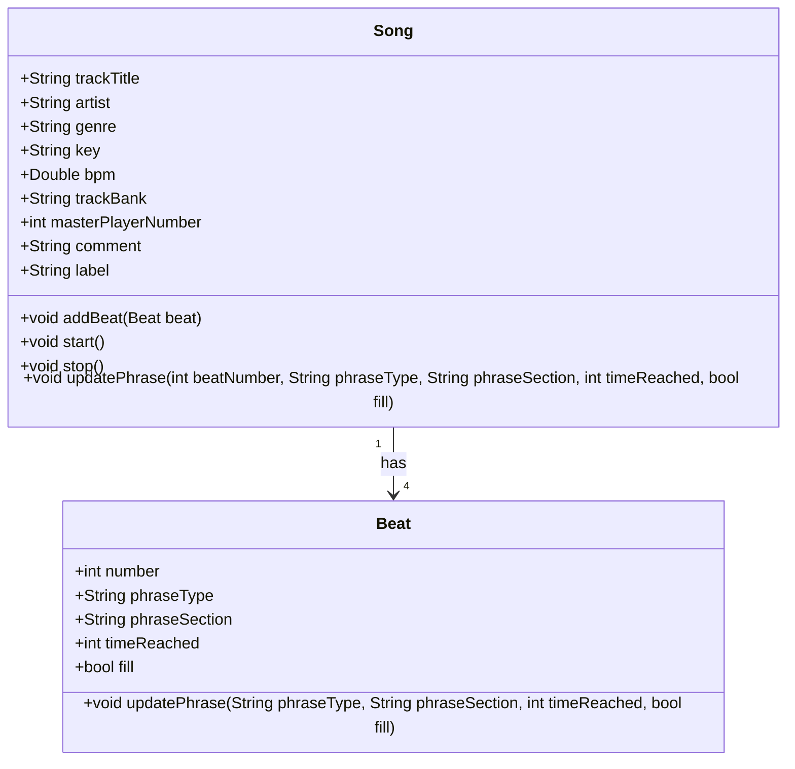

# Welcome to the Bridge between Rekordbox, Pro DJ Link via Beat Link Trigger and Python

## Aim of the project is to build a bridge from what is now playing on a Pro DJ Link device

> **Disclaimer**: This project is **not** affiliated with Pioneer Corp. or its related companies
in any way and has been written independently! NowPlayingXZ is licensed under the
[MIT license][license-link]. The maintainers of the project are not liable for any damages to your Rekordbox library.

### Technology

- [Rekordbox](http://rekordbox.com) 7.0 from [AlphaTheta](http://http://alphatheta.com/) (formerlery known as Pioneer DJ)
- [Pro DJ Link](https://support.pioneerdj.com/hc/en-us/articles/4405902925593-What-is-the-PRO-DJ-LINK-function) enabled Hardware (my Pioneer XDJ-XZ)
- 3rd Party Software [Beat Link Trigger](https://github.com/Deep-Symmetry/beat-link-trigger) from [Deep Symmetry](https://deepsymmetry.org)
- UDP as protocol from clojures driven BLT to [Python](python.org)
- Python scripts to bring the data from BLT via UDP into an UI

### Motivation

For years i like to play my favorite songs with Rekordbox, installed on my Mac.
I own some controllers, the DDJ 400, DDJ 800, RB-DMX-1, DDJ-XP2 und the XDJ-XZ as standalone player.  

Played around with different solutions like SoundSwitch to get my lighting in sync of the playing song.

### Idea

My idea is to bring that together by using Pro DJ Link in combination with Deep Symmetry's great solution Beat Link Trigger and python

Player Status ![Player Status][id]

### UML Class diagramm

[id]: img/played_displayed_via_blt.png

[license-link]: https://github.com/hfanieng/nowplaying_rb_blt_udp/blob/main/LICENSE
